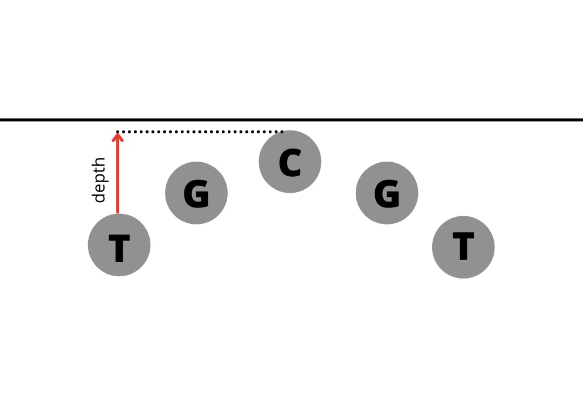

```{r setup, echo = FALSE}
knitr::opts_chunk$set(fig.retina = 3, warning = FALSE, message = FALSE)
```

```{r xaringan-themer, include=FALSE, warning=FALSE}
library(xaringanthemer)
style_mono_accent(base_color = "#2d8dd6")
```

# Previous Play Type Prediction Models

- Use only situational factors from play by play data

- Accuracy: 70.1 %

---
# The Data

```{r load-packages, warning = FALSE, message = FALSE, echo = FALSE}
library(tidyverse)
library(tidymodels)
library(vip)
library(data.table)
library(ggthemes)

```

```{r load-data, warning = FALSE, message = FALSE, echo = FALSE}
#Load Tabular Data
plays <- read_csv("Data/plays.csv")
players <- read_csv("Data/players.csv")
games <- read_csv("Data/games.csv")

#FastR Data
pbp_17 <- nflfastR::load_pbp(2017)

#Single Tracking File
tracking_game_2017090700 <- read_csv("Data/tracking_gameId_2017090700.csv")
  
##Reading All tracking data

#weeks of NFL season'
ID <- c("090700", "091000", "091001", "091002", "091003", "091004", "091005", "091007", "091008", "091009", "091010",
        "091011", "091012", "091100", "091101", "091400", "091700", "091701", "091702", "091703", "091704","091705",
        "091706", "091707", "091708", "091709","091710", "091711", "091712", "091713", "091800", "092100", "092401",
        "092402", "092403", "092404", "092405", "092406", "092407","092408", "092409", "092410", "092411", "092412",
        "092413", "092500", "092800", "100100", "100101", "100102", "100103", "100104", "100105", "100106","100107",
        "100108", "100109", "100110", "100111", "100112", "100113", "100200", "100500", "100800", "100801","100802", 
        "100803", "100804", "100805", "100806", "100807", "100808", "100809", "100810", "100811", "100900", "101200",
        "101500","101501", "101502", "101503", "101504", "101505", "101506", "101507", "101508", "101509", "101510",
        "101511", "101600")

#blank dataframe to store tracking data
df_tracking <- list()

#iterating through all weeks
for(i in 1:length(ID)){
  
  #temperory dataframe used for reading week for given iteration
  df_tracking_temp <- read_csv(paste0("Data/tracking_gameId_2017",ID[i],".csv"),
                               col_types = cols())
  
  df_tracking[[i]] <- df_tracking_temp
  
}

tracking <- rbindlist(df_tracking)

```

NFL 2017 Tracking Data Week 1 Through Week 6 

Corresponding NFL Plays, Games and Players Data

NFL FastR 2017 Play by Play Data


```{r display-data, warning = FALSE, message = FALSE, echo = FALSE}
library(gt)
tracking %>% slice_head(n = 5) %>% select(nflId, x, y, dir,event,displayName, frame.id, playId, gameId) %>% gt()
```


---

# Created a Baseline Situational Factors Predictive Model for Comparison Purposes

- Predictors:

  - Quarter
  - Down
  - Yards to Go
  - Yardline Number
  - Shotgun Formation
  - Half Seconds Remaining  
  - Score Differential
  
--

- Accuracy: 72.6%
- Brier Score: 0.1983135

---

# Defining Variables Created from Tracking Data

- Width of Formation + Standard Deviation
- Width of Offensive Line + Standard Deviation 
- Depth of Offensive Line
- Deep Backfield RB- Indicator Variable
- QB Position (Under Center, Shotgun, Pistol)
- Personnel (Number of WRs, RBs, TEs)
- Fullback- Indicator Variable


```{r out.width='35%', echo = FALSE, fig.align='bottom'}

```

---
# Defining Variables Created from Tracking Data

- Width of Formation + Standard Deviation
- Width of Offensive Line + Standard Deviation 
- Depth of Offensive Line
- Deep Backfield RB- Indicator Variable
- QB Position (Under Center, Shotgun, Pistol)
- Personnel (Number of WRs, RBs, TEs)
- Fullback- Indicator Variable

--

__TBA Tracking Data Variables__

- In Motion
- Isolated Receivers
- Number of Receivers on Opposite Side of Ball
- Maximum Distance Receivers Start Behind Line

---

## Using Only Tracking Data Variables to Predict Play Type Results in a Similar Accuracy to the Only Situational Factors Model

--

- Situational Factors Only Accuracy: 72.6%

- Tracking Data Variables Only Accuracy: 71.6%


---

## Using a Mixture of Tracking Data Variables and Situational Variables Produces the Most Accurate Model

--

- Situational Factors Only Accuracy: 72.6%

- Tracking Data Variables Only Accuracy: 71.6%

- Mixture of Situational Factors and Tracking Data Variables Accuracy: 73.65079%

--

- Situational Factors Only Brier Score: 0.1983135

- Mixture of Situational Factors and Tracking Data Variables Brier Score: 0.1927617


---

# Completed Work

- Created variables using tracking data
- Created a basic model using only play by play data
- Started creating models using tracking data variables

--

# Future Work

- More variables from tracking data
- Better accuracy
- Look at predictability of NFL teams
- Pinpoint the strengths of our model

---
### Definitions of the Variables Created From Tracking Data 

- Width of Formation
  - Width (in yards) of the offensive formation at the snap
  - Horizontal distance between the players closest to each sideline
  - Maximum Y value of offensive players at the snap minus the minimum Y value of offensive players at the snap
  
- Width of Offensive Line
  - Width (in yards) of the offensive line at the snap
  - Horizontal distance between the right most lineman and left most lineman
  - Maximum Y value of offensive linemen at the snap minus the minimum Y value of offensive linemen at the snap

- Depth of Offensive Line
  - Helps to understand the effects of offensive line curvature
  - Maximum X value of offensive linemen at the snap minus the minimum X value of offensive linemen at the snap

---

### Definitions of the Variables Created From Tracking Data Cnt.

- Deep Backfield RB- Indicator Variable
  - 1 indicates the RB is greater than or equal to 4 yards behind the QB at the snap
  - 0 indicates the RB is less than 4 yards behind the QB at the snap

- QB Position (Under Center, Shotgun, Pistol)
  - Three separate indicator variables showing QB positioning
  - 1 indicates the QB is in that position at the snap
  - 0 indicates the QB is not in that position at the snap

- Personnel (Number of WRs, RBs, TEs)
  - Three separate variables indicating the number of players on the field at the snap in each of the position         groups

- Fullback- Indicator Variable
  - 1 indicates there is a fullback on the field at the snap
  - 0 indicates there is not a fullback on the field at the snap


